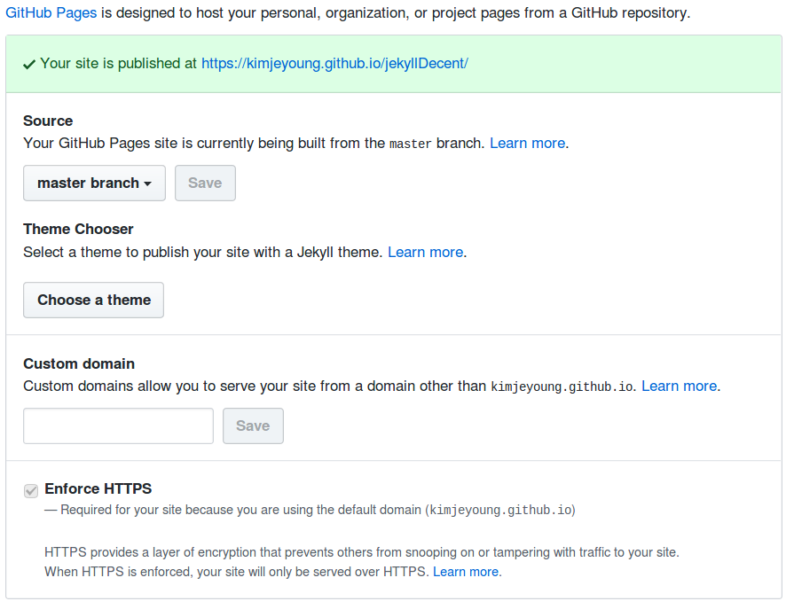
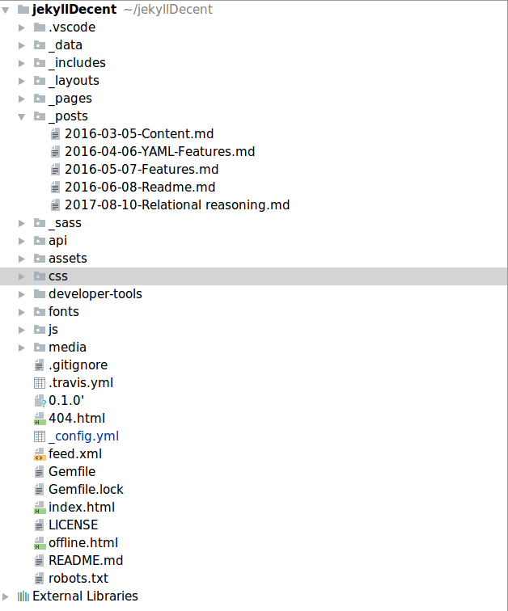
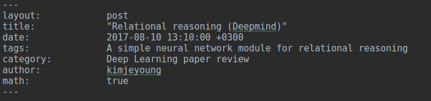
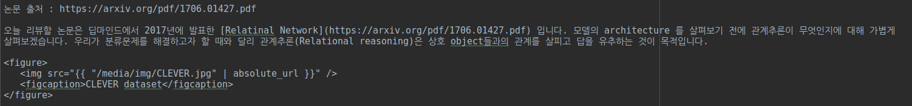

# TEAMLAB BLOG POSTING
TEAMLAB 블로그 운영에 따른 포스팅 방법을 기제해 놓은 곳입니다.

### TEAMLAB BLOG URL
[TEAMLAB BLOG HOMEPAGE](https://teamlab.github.io/jekyllDecent)

### HOW TO UPLOAD MY POSTING

1. Fork teamlab jekyllDecent
    * [Repository](https://github.com/teamlab/jekyllDecent)
 

2. Change your Origin Repository name
    * 첫번째로, Setting 부분의 Repository name 부분이 **jekyllDecent** 으로 설정이 되어있는지 확인합니다.
 

3. Check your site is published

자신의 Origin Repository의 Setting page에서 site가 publish되었는지 확인합니다. 
만약 밑의 이미지와 같이 Your site 의 내용이 보이지 않는다면 Source 에서 Master브랜치로 바꾸어줍니다. 

ex) **https://kimjeyoung.github.io/jekyllDecent/** 를 통해서 자신이 작업하는 포스팅을 확인할 수 있습니다. 

4. Posting

작업 디렉토리의 구조는 다음과 같습니다. 포스팅을 하는 디렉토리는 _posts 폴더입니다. 다른 폴더는 가급적 사용하지 말아 주세요. 
포스팅을 하기위해 _posts 폴더안에 파일을 생성합니다. 파일을 생성하는 규칙이 정해져 있기 때문에 꼭 규칙을 지켜주세요. 
파일의 형식은 마크다운확장자를 가지며 파일의 이름은 **날짜-제목**으로 만들어 주어야합니다. 
예) 2018-03-21-Posting.md  

생성한 마크다운 파일에 위의 이미지처럼 제목과 기타 세부항목을 작성해 주어야 합니다.  
**layout** : 이 값은 변하지 않습니다. 항상 post로 작성해주세요.  
**title** : Web page에 보여지는 포스팅 제목입니다.  
**data** : 포스팅하는 날짜를 기입해주세요.  
**tags** : 포스팅페이지의 제목밑에 달리는 Tag입니다. 사용하지 않는다면 기입하지 않아도 됩니다. 
**category** : 현재 Tealab blog 홈페이지는 Machine Learning Theory, Deep Learning paper review로 구성이 되어있습니다. 만약 다른 범주에 해당된다면 해당 범주에 맞는 카테고리 명을 기입해주세요. 현재 카데고리에 존재하지 않는 이름이라면 웹페이지에서 새로운 Category가 생성됩니다. 
**author** : Teamlab 멤버들은 각각 영문의 고유 아이디를 가지고 있습니다. 해당 아이디를 사용해야 포스팅밑에 자신의 정보가 포함됩니다. 
**math** : 마크다운언어에서 수식을 사용할지에 대한 여부입니다. 

위의 이미지는 이미지를 기입하는 방법입니다. 랩블로그의 파일을 효율적으로 관리하기 위해서 경로는 **/media/img/**로 통일시켜주세요.

